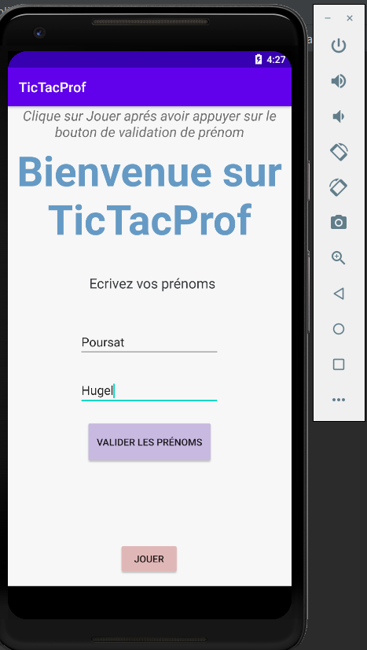
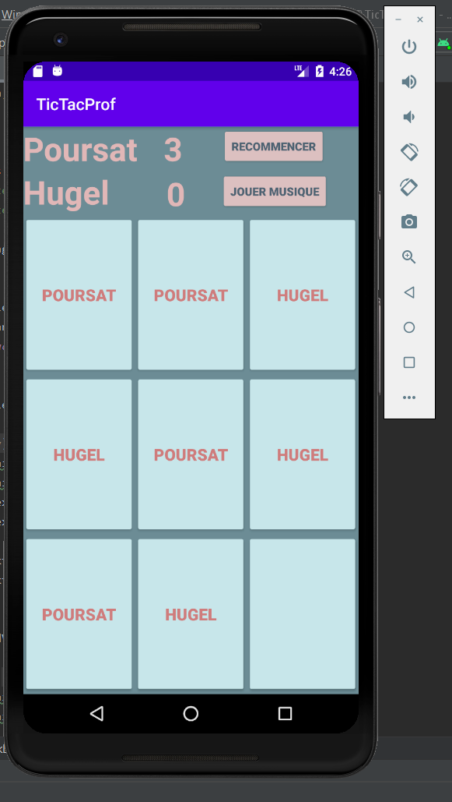

# AndroidApp_TicTacToeProf

 Nous avons développer une application de jeu avec deux autres camardes. C’est une sorte de Tic-Tac-Toe. Un jeu avec une grille et deux joueurs, qui essayent de gagner en alignant trois croix ou trois cercles. Le jeu que nous proposons sera simple d’utilisation afin qu’il puisse être utilisé par les petits comme par les grands et même les très grands.

##Fonctionnalités réalisées : 

* Saisir un utilisateur au début, le joueur jouera avec son prénom.

* Démarrer le jeu.  

* Gestion des scores, dont calcul de point et remise à zéro.

* Recommencer une partie (remise à zéro des points et de la grille).

* Mettre une petite musique de fond avec un bouton pour la déclencher.

* On a ajouté des petites notifications sous la forme de Toast pour annoncer le gagnant.

##L'application

Pour jouer il faut installer l'application avec le fichier "app-release.apk" sur votre téléphone mobile Android.

Voici à quoi resemble le jeu :

